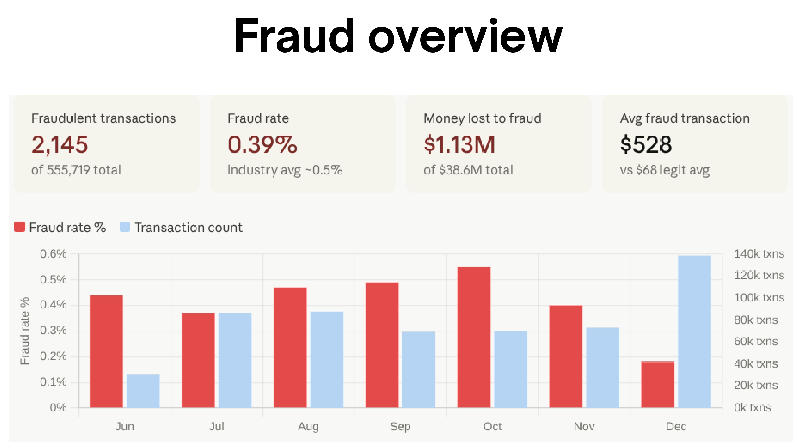
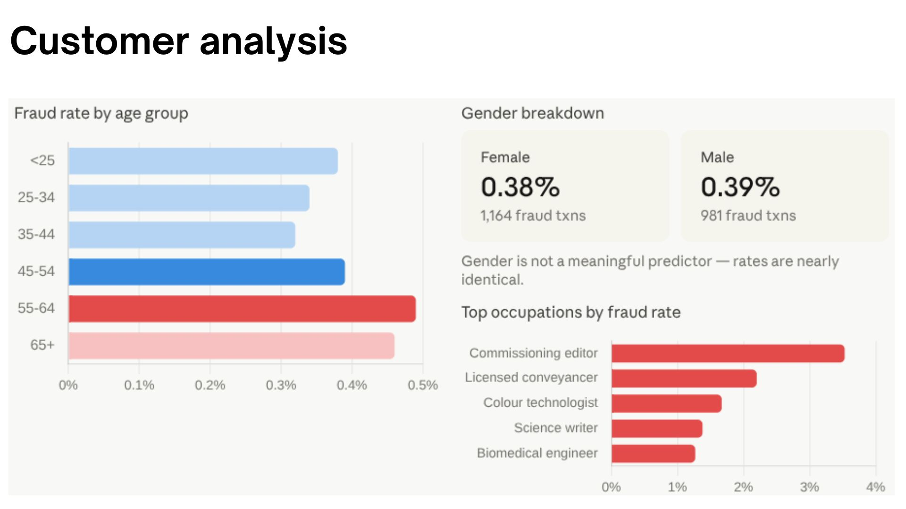
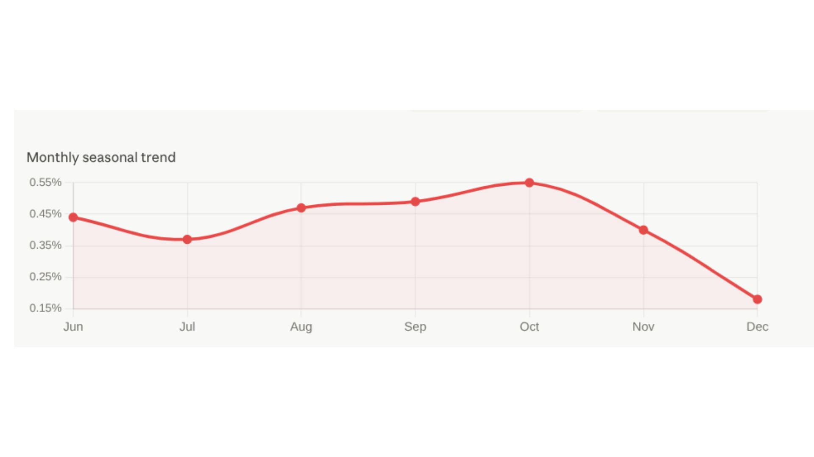
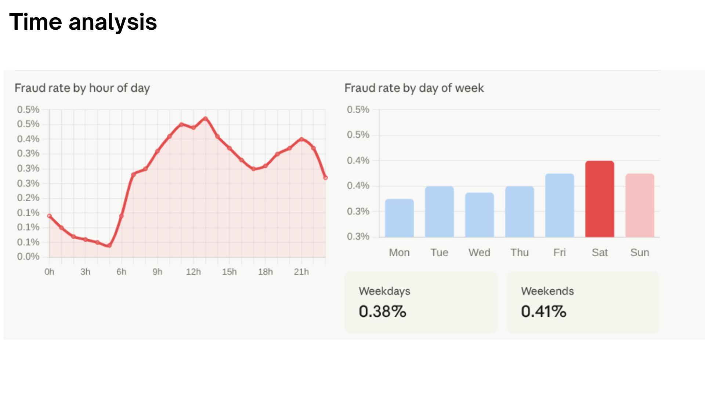
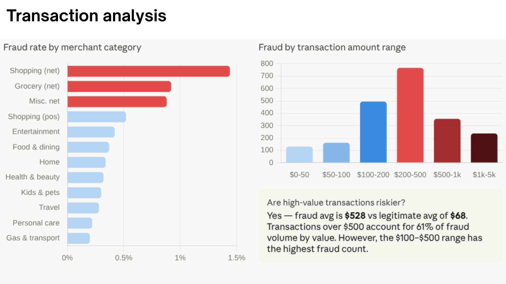
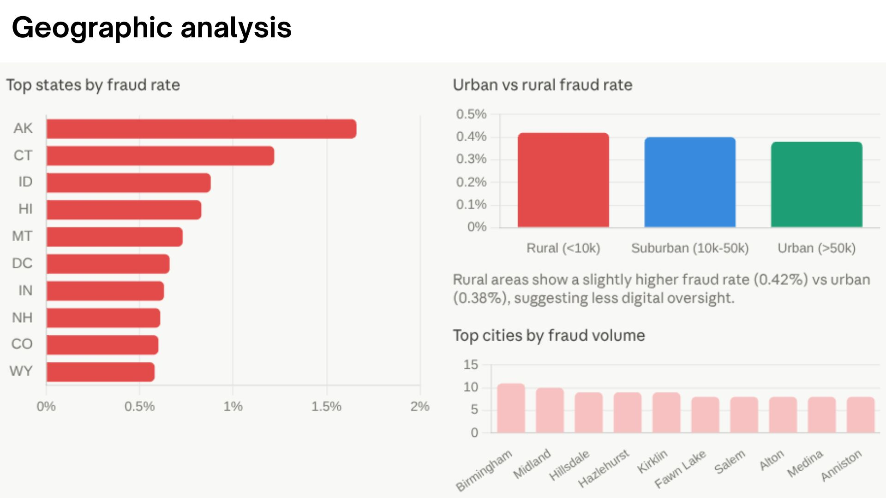
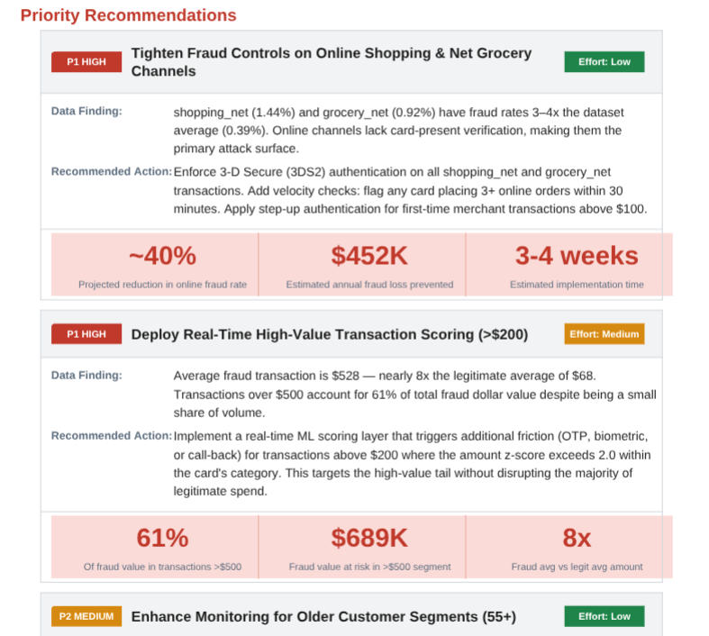

# Credit Card Fraud Analysis

## Project Overview

This project analyzes 555,719 credit card transactions to identify fraud patterns, understand customer and geographic risk factors, and provide actionable recommendations for fraud prevention.

The analysis was performed using SQL for data preparation and Power BI for visualization and business intelligence reporting.

---

## Business Problem

Financial institutions lose millions of dollars annually due to fraudulent transactions. The goal of this project is to identify high-risk customer segments, transaction patterns, locations, and merchant categories that contribute most to fraud losses.

---

## Dataset

* Total Transactions: 555,719
* Fraudulent Transactions: 2,145
* Fraud Rate: 0.39%
* Total Fraud Loss: $1.13 Million

---

## Tools Used

* SQL
* Power BI
* Excel

---

## Analysis Performed

### Fraud Overview

* Overall fraud rate analysis
* Fraud loss calculation
* Monthly fraud trends

### Customer Analysis

* Fraud by gender
* Fraud by age group
* Fraud by occupation

### Geographic Analysis

* Fraud by state
* Fraud by city
* Rural vs urban fraud comparison

### Transaction Analysis

* Fraud by merchant category
* Fraud by transaction amount
* Fraud by time of day
* Fraud by day of week

---

## Key Findings

* Fraud rate peaked at 0.55% in October and declined to 0.18% in December.
* Customers aged 55–64 experienced the highest fraud rate.
* Gender showed little predictive value for fraud detection.
* Alaska recorded the highest state-level fraud rate.
* Online shopping and grocery-net transactions showed the highest fraud risk.
* Fraudulent transactions averaged significantly higher amounts than legitimate transactions.

---

## Dashboard

### Fraud Overview



### Customer Analysis



### Monthly seasonal trend



### Time analysis



### Transaction analysis



### Geographic analysis



### Recommendation



---


## Business Recommendations

1. Increase monitoring of online shopping transactions.
2. Apply additional verification for high-value transactions.
3. Focus fraud prevention efforts on high-risk states.
4. Increase monitoring during peak fraud hours.
5. Improve customer awareness programs targeting older customers.

---

## Repository Structure

```text
credit-card-fraud-analysis
│
├── README.md
├── sql
├── dashboard
├── report
└── data
```

---

## SQL Scripts

- Data Cleaning
- Feature Engineering
- KPI Calculations
- Customer Analysis
- Geographic Analysis
- Transaction Analysis

---

## Full Report

[View Full Report](report/Credit_Card_Fraud_Analysis_Updated.pdf)

---


## Author

Van Serick Bouanga Latchybou

Aspiring Data Analyst | Google Data Analytics Professional Certificate

